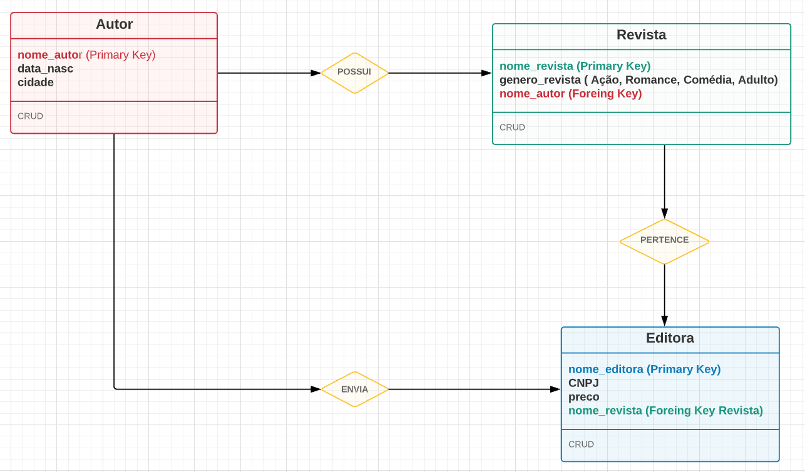

# HqRestAPIshow Project

## A Idéia

#### Desenvolver uma API voltada para o registro de revistas ou HQ (História em Quadrinhos), este projeto contém três tipos de entidades:
<ul>
 <li>Autor: responsável pela produção da HQ.</li>
 <li>Revista: criada por um determinado autor.</li>
 <li>Editora: responsável pela publicação.</li>
</ul>

Modelo criado


#### Dependências deste projeto
<ul>
 <li> express: Framework para desenvolvimento desta API. </li>
 <li> Knex: Conexão com o banco e migrações. </li>
 <li> Sqlite3: Banco de dados incluso neste projeto. </li>
 <li> Nodemon: Mantém o servidor executando durante o desenvolvimento de novas funcionalidades. </li>
</ul>

## Como Executar?

Execute os seguites comandos:
````
$ npm install
$ npm run start
````

## URL´s para teste das requisições

#### <b>Autor</b>
<ul>
 <li><b>GET:</b> <i>http://localhost:5000/autor</i> </li>
 <li><b>POST:</b> <i>http://localhost:5000/autor</i> </li>
 <li><b>PUT:</b> <i>http://localhost:5000/autor/<nome-autor></i> </li>
 <li><b>DELETE:</b> <i>http://localhost:5000/autor/<nome-autor></i> </li>
</ul>

#### <b>Revista</b>
<ul>
 <li><b>GET:</b> <i>http://localhost:5000/revista</i> </li>
 <li><b>POST:</b> <i>http://localhost:5000/revista</i> </li>
 <li><b>PUT:</b> <i>http://localhost:5000/revista/<nome-revista></i> </li>
 <li><b>DELETE:</b> <i>http://localhost:5000/revista/<nome-revista></i> </li>
</ul>
    
